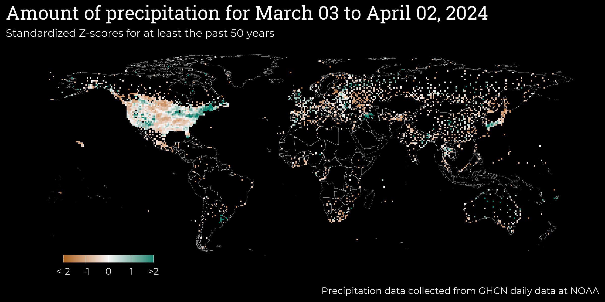

```{r echo = FALSE, message = FALSE}
library(lubridate)
```

```{css, echo = FALSE}
.title {
    display: none;
}
.main-container {
    max-width: 100%
}

body {
    background-color: black;
    color: #f5f5f5;
    font-size: 1.2vw;
}
```



Last updated on `r today()`
